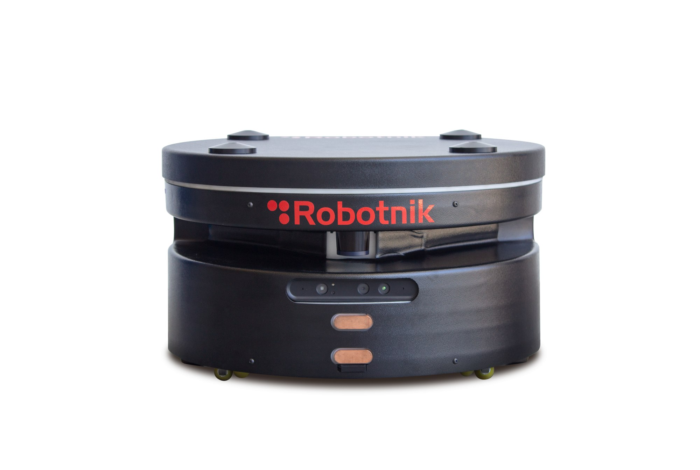

# rb1_base_sim


Packages for the simulation of the RB-1 Base

<p align="center">
  
</p>


## Packages

### rb1_base_gazebo

This package contains the configuration files and worlds to launch the Gazebo environment along with the simulated robot.

### rb1_base_sim_bringup

Launch files that launch the complete simulation of the robot/s.


## Simulating RB-1 Base

### 1) Install the following dependencies:

This simulation has been tested using Gazebo 9 version. To facilitate the installation you can use the vcstool:

```bash
sudo apt-get install -y python3-vcstool
```

### 2) Create a workspace and clone the repository:

```bash
mkdir catkin_ws
cd catkin_ws
vcs import --input \
  https://raw.githubusercontent.com/RobotnikAutomation/rb1_base_sim/melodic-master/repos/rb1_base_sim.repos
rosdep install --from-paths src --ignore-src -y
```

### 3) Compile:

```bash
catkin build
source devel/setup.bash
```


### 4) Launch RB-1 Base simulation (1 robot by default, up to 3 robots):
- RB-1 Base:

```bash
roslaunch rb1_base_sim_bringup rb1_base_complete.launch
```

Optional general arguments:
```xml
<arg name="launch_rviz" default="true"/>
<arg
  name="gazebo_world"
  default="$(find rb1_base_gazebo)/worlds/rb1_base_office.world"
/>
```
  Optional robot arguments:
```xml
<!--arguments for each robot (example for robot A)-->
<arg name="id_robot_a" default="robot"/>
<arg name="launch_robot_a" default="true"/>
<arg name="has_elevator_robot_a" default="true"/>
<arg name="x_init_pose_robot_a" default="0.0" />
<arg name="y_init_pose_robot_a" default="0.0" />
<arg name="z_init_pose_robot_a" default="0.0" />
<arg name="init_yaw_robot_a" default="0.0" />
<arg name="gmapping_robot_a" default="false"/>
<arg name="amcl_and_mapserver_robot_a" default="true"/>
<arg name="map_frame_robot_a" default="$(arg id_robot_a)_map"/>
<arg
  name="map_file_robot_a"
  default="$(find rb1_base_localization)/maps/willow_garage/willow_garage.yaml"
/>
<arg name="move_base_robot_a" default="true"/>
<arg name="pad_robot_a" default="true"/>
```
- Example to launch simulation with 3 RB-1 Base robots:
```bash
roslaunch rb1_base_sim_bringup rb1_base_complete.launch \
  launch_robot_a:=true \
  launch_robot_b:=true \
  launch_robot_c:=true
```
- Example to launch simulation with 1 RB-1 Base robot with navigation and localization:
```bash
roslaunch rb1_base_sim_bringup rb1_base_complete.launch \
  launch_robot_a:=true \
  move_base_robot_a:=true \
  amcl_and_mapserver_robot_a:=true
```
- Example to launch simulation with 2 RB-1 Base robot with navigation and localization sharing the same global frame:
```bash
roslaunch rb1_base_sim_bringup rb1_base_complete.launch \
  launch_robot_a:=true \
  amcl_and_mapserver_robot_a:=true \
  move_base_robot_a:=true \
  map_frame_a:=/map \
  launch_robot_b:=true \
  amcl_and_mapserver_robot_b:=true \
  move_base_robot_b:=true \
  map_frame_b:=/map
```
- Example to launch simulation with 3 RB-1 Base robot with navigation and localization sharing the same global frame:
```bash
roslaunch rb1_base_sim_bringup rb1_base_complete.launch \
  launch_robot_a:=true \
  amcl_and_mapserver_robot_a:=true \
  move_base_robot_a:=true \
  map_frame_a:=/map \
  launch_robot_b:=true \
  amcl_and_mapserver_robot_b:=true \
  move_base_robot_b:=true \
  map_frame_b:=/map \
  launch_robot_c:=true \
  amcl_and_mapserver_robot_c:=true \
  move_base_robot_c:=true \
  map_frame_c:=/map
```

### Comands and data retreving
**Enjoy! You can use the topic `${id_robot}/robotnik_base_control/cmd_vel` to control the RB-1 Base robot:**

```bash
rostopic pub /robot/robotnik_base_control/cmd_vel geometry_msgs/Twist "linear:
  x: 0.1
  y: 0.0
  z: 0.0
angular:
  x: 0.0
  y: 0.0
  z: 0.0" -r 10
```

or if you have launched move_base, you can send simple goals using `/${id_robot}/move_base_simple/goal`:
```bash
rostopic pub /robot/move_base_simple/goal geometry_msgs/PoseStamped "header:
  seq: 0
  stamp:
    secs: 0
    nsecs: 0
  frame_id: 'robot_map'
pose:
  position:
    x: 3.0
    y: 0.0
    z: 0.0
  orientation:
    x: 0.0
    y: 0.0
    z: 0.0
    w: 1.0" 
```

## Docker usage

In order to run this simulation you will need nvidia graphical accelation

### Installation of required files
- [docker](https://docs.docker.com/engine/install/ubuntu/)
- [nvidia-docker](https://docs.nvidia.com/datacenter/cloud-native/container-toolkit/install-guide.html#docker)
- nvidia-drivers

### Usage

```bash
git clone https://github.com/RobotnikAutomation/rb1_base_sim.git
cd rb1_base_sim
git checkout melodic-devel
docker/simulation-in-container-run.sh

```
#### Docker permission fix

In order to run this simulation it's mandatory to the current linux user to have full docker permission. If the script fails due to that, please execute the following command:
```bash
sudo usermod -aG docker $USER
```
And logout and login in order to make this change effective

#### Selecting the robot model

You can select the robot, the launch file of package using the optional arguments on launch
By default the selected robot is `rb1_base`

```bash
docker/simulation-in-container-run.sh --help
```

```
ROBOTNIK AUTOMATION S.L.L. 2021

Simulation of RB1 BASE using docker

Usage:
docker/simulation-in-container-run.sh [OPTIONS]

Optional arguments:
 --robot -r ROBOT       Select robot to simulate
                        Valid robots:
                            multirobot_2 multirobot_3 rb1_base
                        default: rb1_base

 --launch -l            Select launch file
                        default: rb1_base_complete.launch \
                                 launch_robot_a:=true \
                                 move_base_robot_a:=true \
                                 amcl_and_mapserver_robot_a:=true

 --package -p           Select ros package
                        default: rb1_base_sim_bringup

 --ros-port -u PORT     Host ros port
                        default: 11345

 --gazebo-port -g PORT  Host ros port
                        default: 11345

 -h, --help             Shows this help

```

**2 robots simulation**
```bash
docker/simulation-in-container-run.sh --robot multirobot_2
```

**3 robots simulation**
```bash
docker/simulation-in-container-run.sh --robot multirobot_3
```

#### Manual Build

If you wish to build manually the image without the use of the script use one the following commands:

**Optiona A**
```bash
cd docker
docker build -f Dockerfile ..
```
**Option B**
```bash
docker build -f docker/Dockerfile .
```

#### Notes

- This is docker requires a graphical interface
- The ros master uri is accesible outside the container, so in the host any ros command should work
- If you already have a roscore o gzserver on your machine running please change the port using the `--ros-port -u PORT` and/or `--gazebo-port -g PORT`
- if you want to enter on the container use the following command in another terminal
```bash
docker container exec -it rb1_base_sim_instance bash
```
- In order to exit you have to 2 options
1. Close `gazebo` and `rviz` and wait a bit
2. execute in another terminal:
```bash
docker container rm --force rb1_base_sim_instance
```